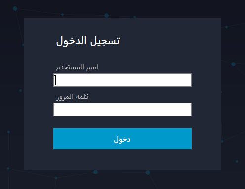
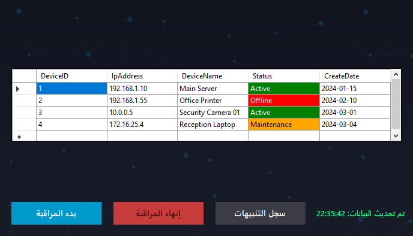
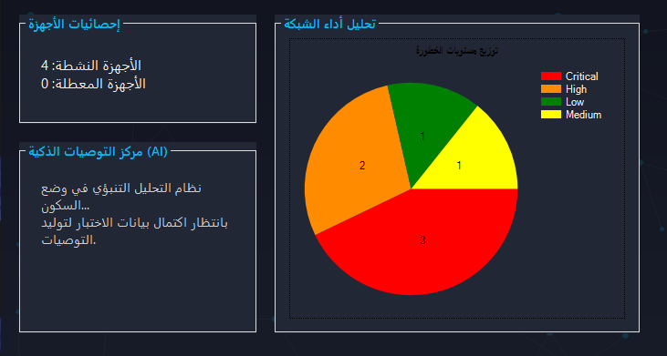

# NetGuard 🛡️

**NetGuard** is a desktop network monitoring system built with C# WinForms and SQL Server. It tracks connected devices in real time, logs alerts by severity level, and uses a simple predictive engine to flag devices with repeated critical incidents.

## Features

- 🔐 **Login system** with attempt limiting (locks after 3 failed tries)
- 📡 **Live device monitoring** — auto-refreshing grid of devices with status (Active / Offline / Maintenance), color-coded
- 🚨 **Alerts log** — alerts joined with type and severity, color-coded by severity (Critical / High / Medium / Low)
- 🤖 **AI Predictive Engine** — automatically flags any device with 3+ critical/high incidents in the last 24 hours and shows a recommendation popup
- 📊 **Dashboard** — pie chart breakdown of alerts by severity, using the same severity color scheme as the alerts screen
- 🎨 Custom branded UI (dark network-themed background, custom logo/icon)

## Tech Stack

- **Language:** C# (.NET Framework 4.8)
- **UI:** Windows Forms
- **Database:** SQL Server (T-SQL)
- **Data Access:** ADO.NET (`System.Data.SqlClient`)
- **Charts:** `System.Windows.Forms.DataVisualization.Charting`

## Screenshots







## Database Schema

The system uses 6 related tables:

| Table | Purpose |
|---|---|
| `Users` | login accounts and roles |
| `DeviceType` | device categories (Laptop, Printer, Server, Router) |
| `Devices` | monitored devices, linked to type and owner |
| `AlertType` | alert categories (System Check, Performance, Connectivity, Security) |
| `Severity` | severity levels (Low, Medium, High, Critical) with time limits |
| `Alerts` | logged alerts, linked to device, type, and severity |

Full schema and seed data are in [`NetGuard.sql`](./NetGuard.sql).

## How to Run

1. Restore the database:
   - Open SQL Server Management Studio and run the SQL script to create `NetGuard` and its tables.
2. Open `NetGuard.sln` in Visual Studio.
3. Update the connection string in `App.config` if your SQL Server instance name is different:
   ```xml
   <add name="Myconn"
        connectionString="Data Source=.;Initial Catalog=NetGuard;Integrated Security=True;TrustServerCertificate=True" />
   ```
4. Build and run (`F5`).

## Project Structure

```
NetGuard/
├── Form1.cs / .Designer.cs   → Welcome screen
├── Form2.cs / .Designer.cs   → Login
├── Form3.cs / .Designer.cs   → Device monitoring
├── Form4.cs / .Designer.cs   → Alerts + AI predictive engine
├── Form5.cs / .Designer.cs   → Dashboard (charts)
├── Branding.cs       → shared UI branding (icon/background)
├── Resources/                   → logo & background images
└── App.config                → database connection string
```

## About

Built as a graduation/college team project focused on real-time network device monitoring with a simple AI-driven alerting layer.

---

<div dir="rtl">

## نبذة عن المشروع (بالعربي)

**NetGuard** هو نظام مراقبة شبكات (Desktop App) اتبنى بلغة C# باستخدام Windows Forms وقاعدة بيانات SQL Server. البرنامج بيراقب الأجهزة المتصلة بالشبكة لحظيًا، وبيسجل التنبيهات حسب مستوى الخطورة (Critical / High / Medium / Low)، وفيه محرك تنبؤ ذكي بسيط بيرصد أي جهاز بيتكرر عليه أعطال خطيرة خلال 24 ساعة وينبّه المستخدم.

### أهم الأجزاء:
- تسجيل دخول بحد أقصى 3 محاولات
- شاشة مراقبة أجهزة بتحديث تلقائي كل 5 ثواني
- سجل تنبيهات ملوّن حسب الخطورة
- محرك ذكاء اصطناعي تنبؤي بيرصد الأنماط المتكررة
- لوحة تحكم فيها رسم بياني (Pie Chart) لتوزيع التنبيهات

</div>
